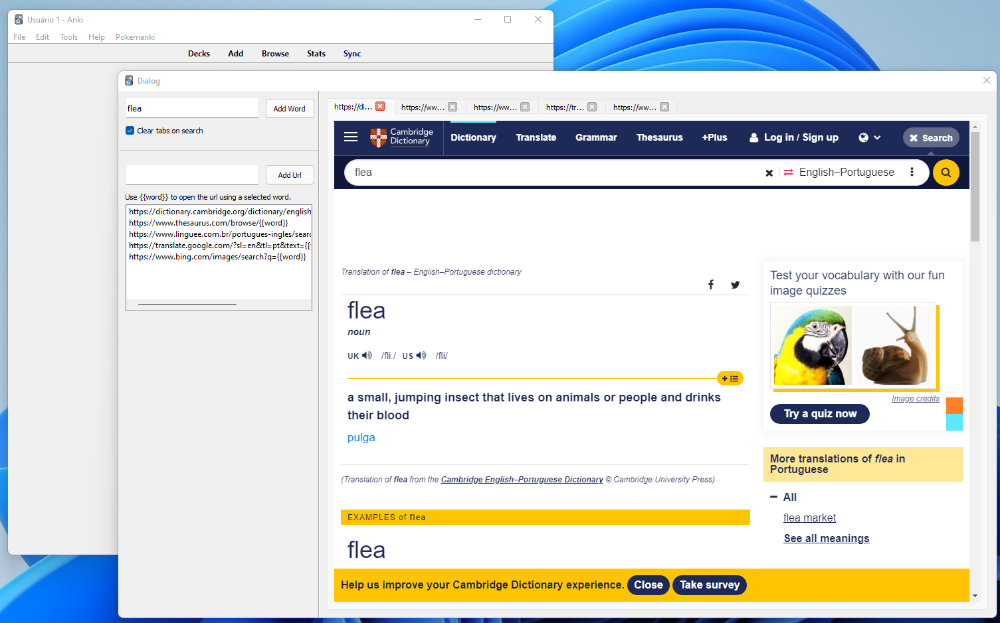

# QQSearch (Anki Addon)

> ignore the horrible code

### Problem:
When you try create cards with a lot of information we need open a lot of differents tabs inside chrome.

### Resolution:
The addon will open all the tabs inside a anki dialog using the created urls.

### Example:
You ever open 2 (can be more) links:
- https://www.linguee.com.br/portugues-ingles/search?source=auto&query=pitfall
- https://www.thesaurus.com/browse/pitfall

In the addon this could be:
- https://www.linguee.com.br/portugues-ingles/search?source=auto&query={{word}}
- https://www.thesaurus.com/browse/{{word}}

So when you type for example: `Claw`, will open two tabs putting the word inside the `{{word}}`.

## How use
For now i won't create a offical anki addon to be installed. So please, execute a `git clone` inside the anki addons folder.
