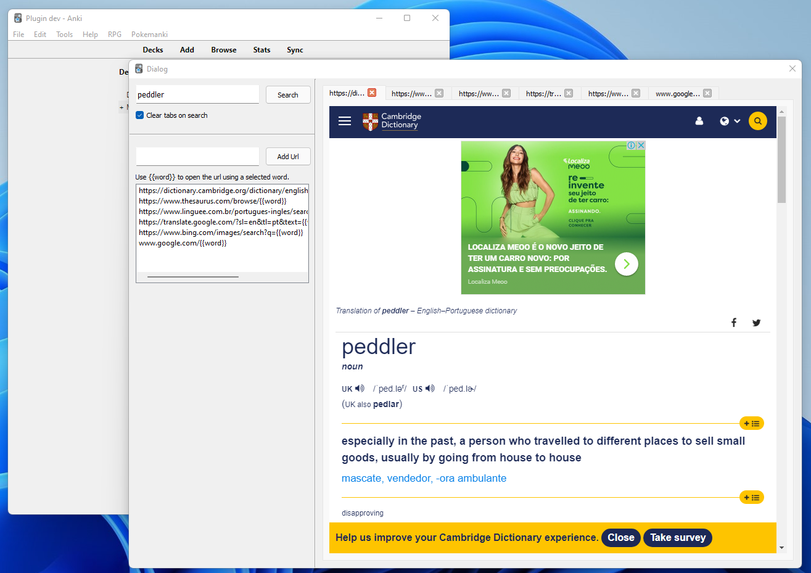

# QQSearch (Anki Addon)

Anki link: https://ankiweb.net/shared/info/1227682730

### Problem:
When you try create cards with a lot of information you should open a lot of differents tabs inside your browser. The setup to start looking for a defintion/translation/examples some times are hard.

### Resolution:
The addon will open all the tabs inside a anki dialog to facilitate searching for information.

### Example configuration



These URLs are for someone that is studying `English from Portuguese` so please, remember to create your URL's by yourself.

```
{
    "urls": [
        "https://dictionary.cambridge.org/dictionary/english-portuguese/{{word}}",
        "https://www.thesaurus.com/browse/{{word}}",
        "https://www.linguee.com.br/portugues-ingles/search?source=auto&query={{word}}",
        "https://translate.google.com/?sl=en&tl=pt&text={{word}}&op=translate",
        "https://www.bing.com/images/search?q={{word}}"
    ]
}
```

> How access the config? Tools > Select the addon > Config button > Paste the code there